# FirstClassAchievers

This is a Social Web App

## To Install & Run

`cd Social` 
`npm i` 
`npm start`  

## Features

### Chat
#### Direct Messaging with web sockets
#### Alphabet Contact List
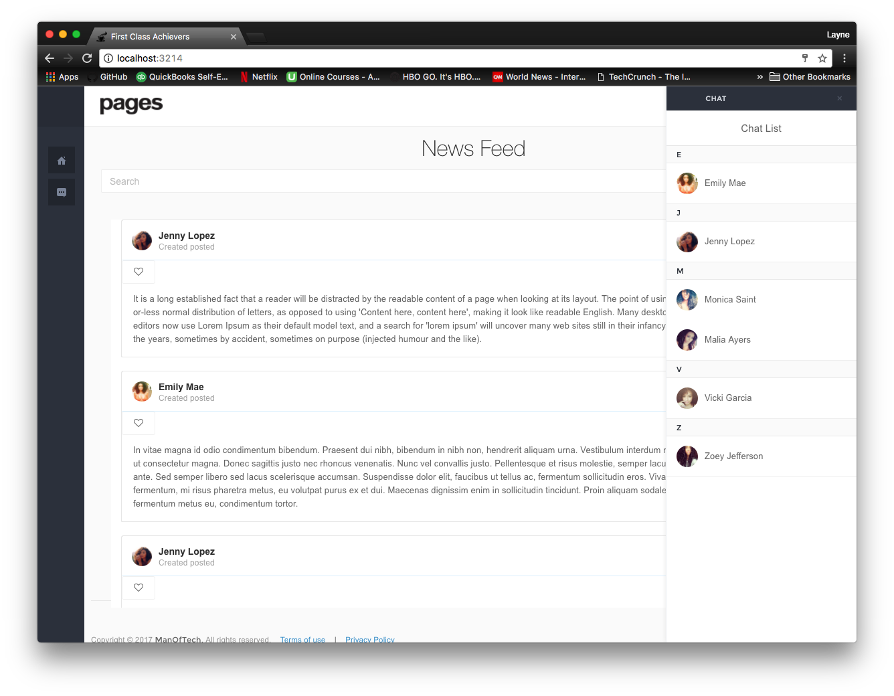
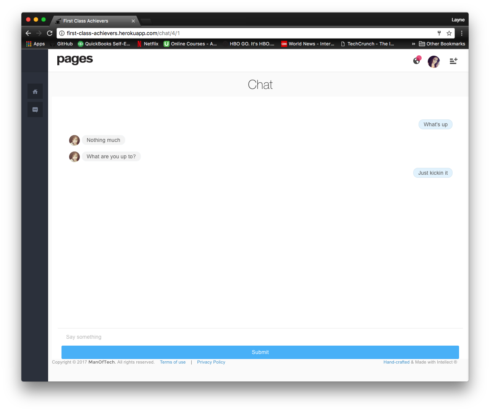
### Notifications
#### Notified when invite to chat, messaged, and followed
#### Notifications linked to recent activity
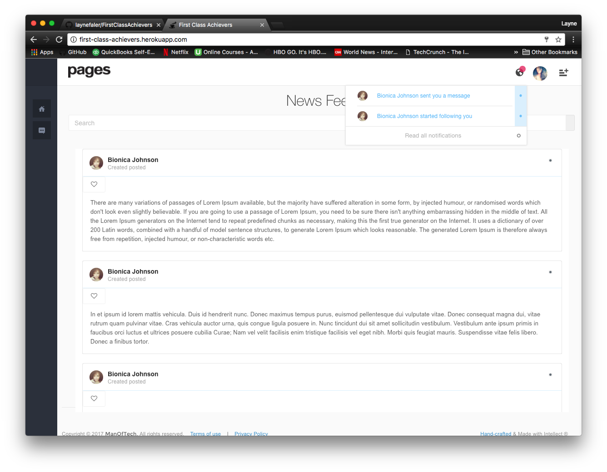
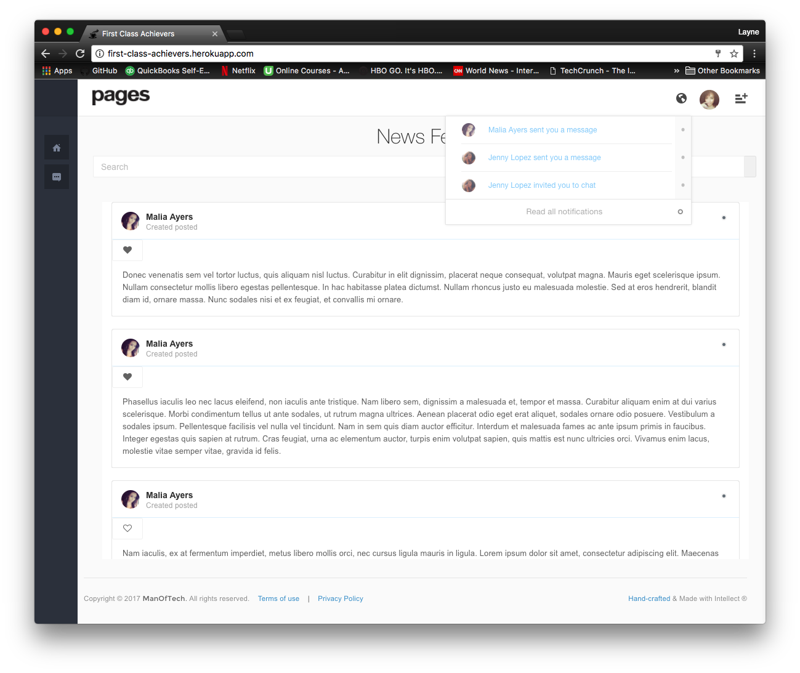
### Authenication
### Unauthenticated View & Authenicated View
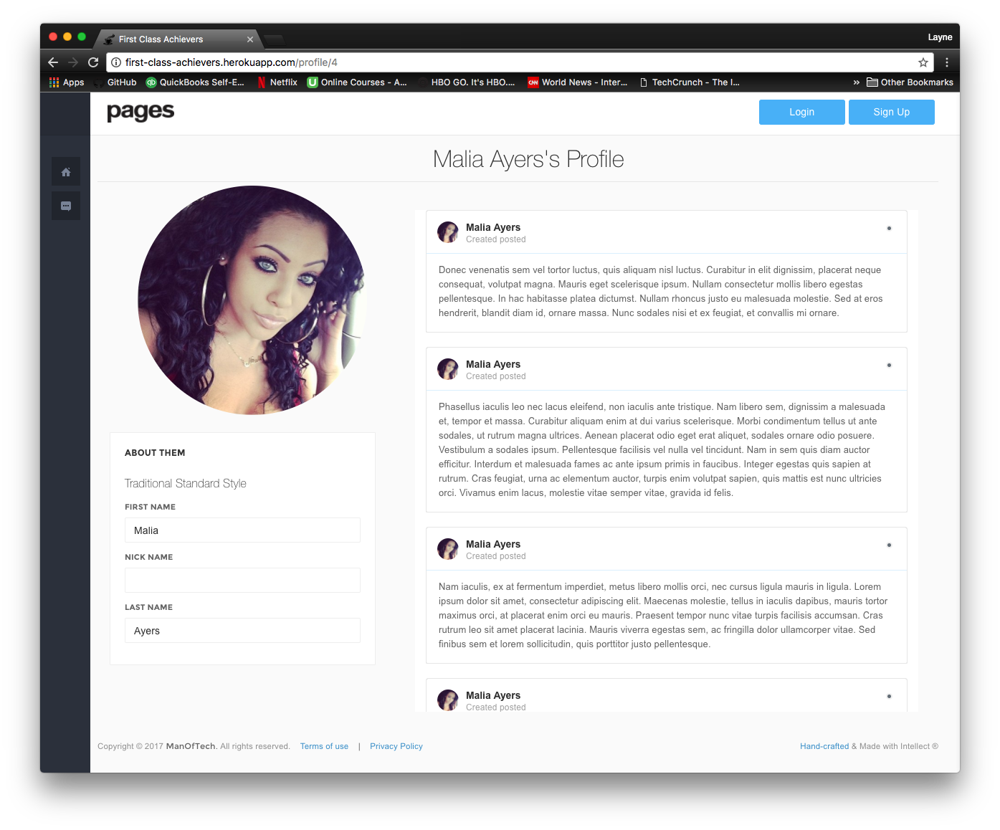

### Favorites
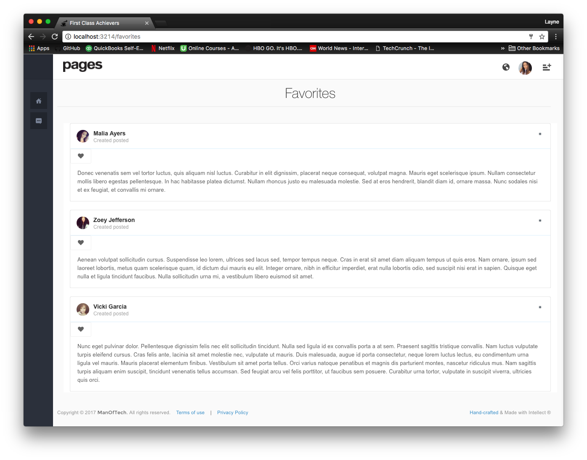
### Followers

### NewsFeed

### Posts (Testimonials)
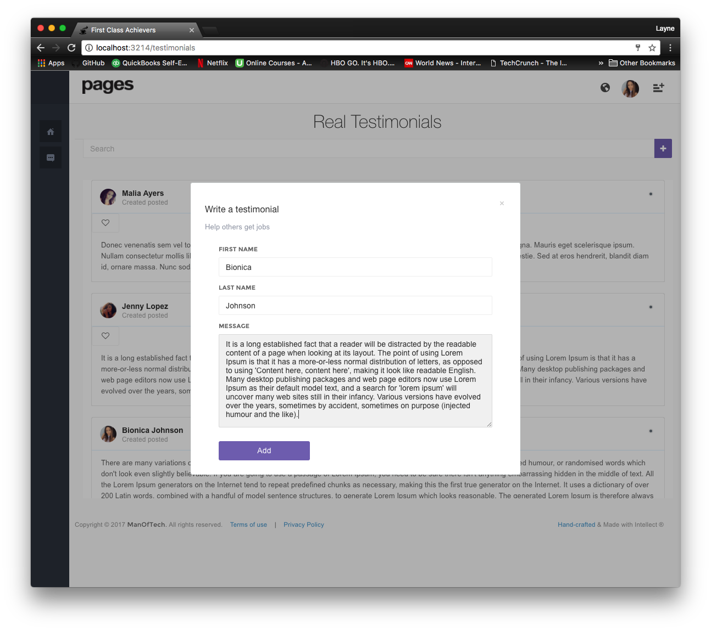
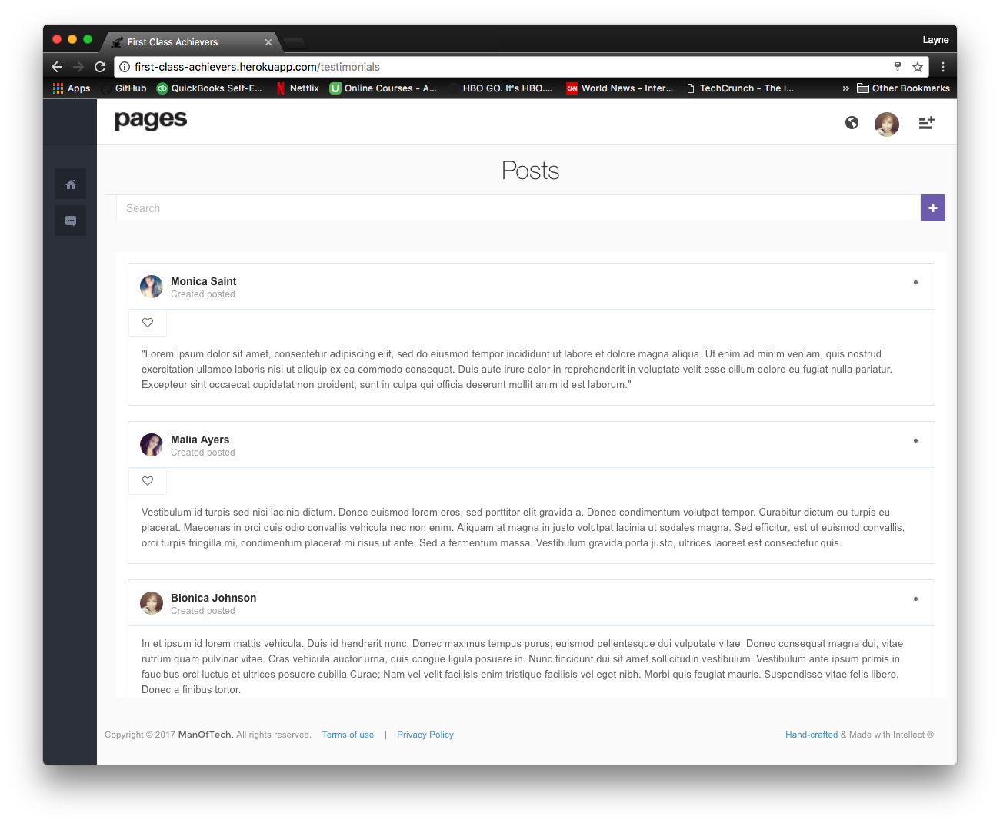
### Profile
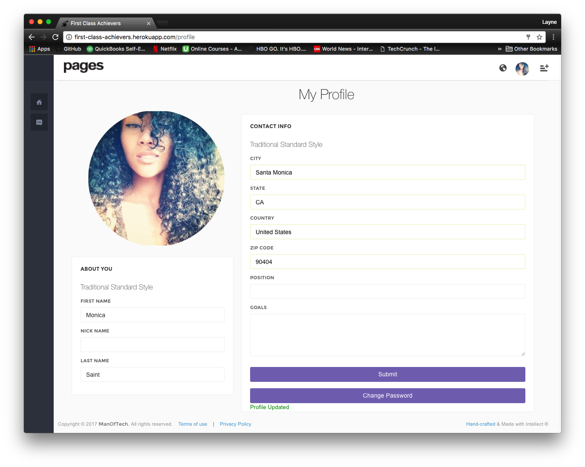
### Detail Pages

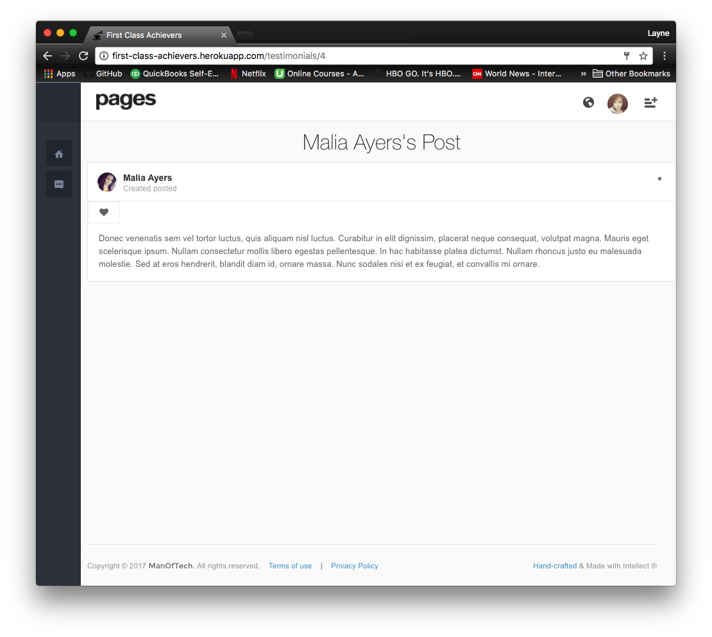
### Cloud Stored Images
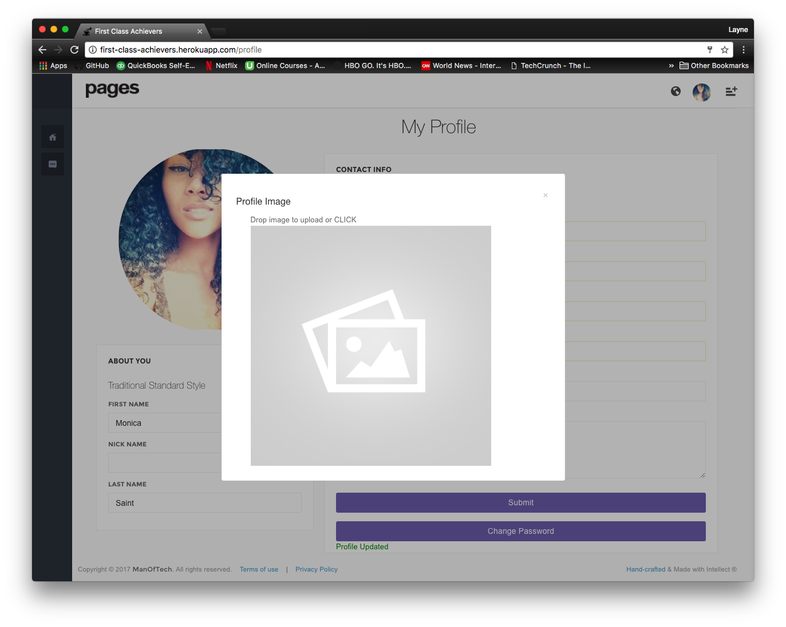
### Cloud Stored Database

## Tech Stack

### React.js
### Redux.js
### Node.js
### Express.js
### Socket IO
### PostgreSQL
### Heroku
### ElephantSQL
### Cloudinary