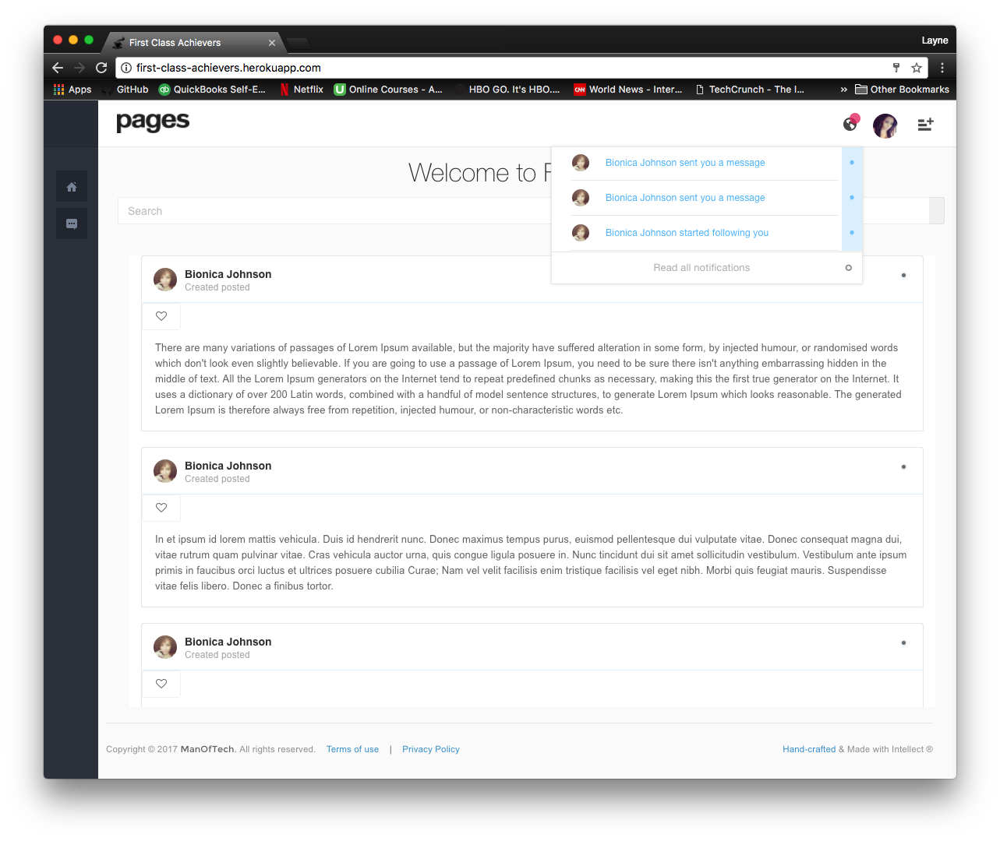
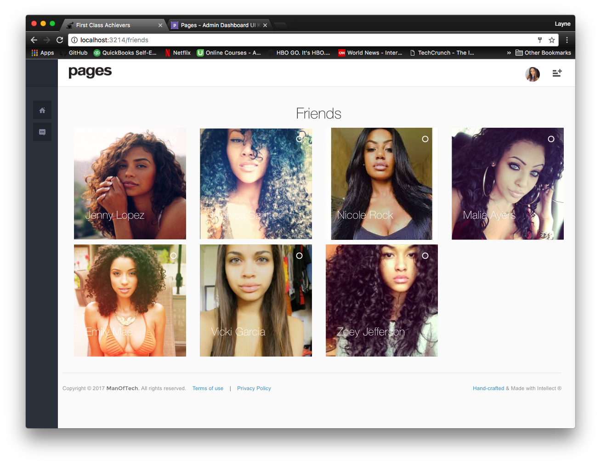

# FirstClassAchievers

## To Install & Run

`npm i` 
`npm start`  

## Features

### Chat
#### Direct Messaging with web sockets
#### Alphabet Contact List

### Notifications
#### Notified when invite to chat, messaged, and followed
#### Notifications linked to recent activity

### Authenication
### Unauthenticated View & Authenicated View
### Friends

### Favorites
### Followers
### NewsFeed
### Blog Posts (Testimonials)
### Profile
### Detail Pages

### Cloud Stored Images
### Cloud Stored Database

## Tech Stack

### React.js
### Redux.js
### Node.js
### Express.js
### Socket IO
### PostgreSQL
### Heroku
### ElephantSQL
### Cloudinary