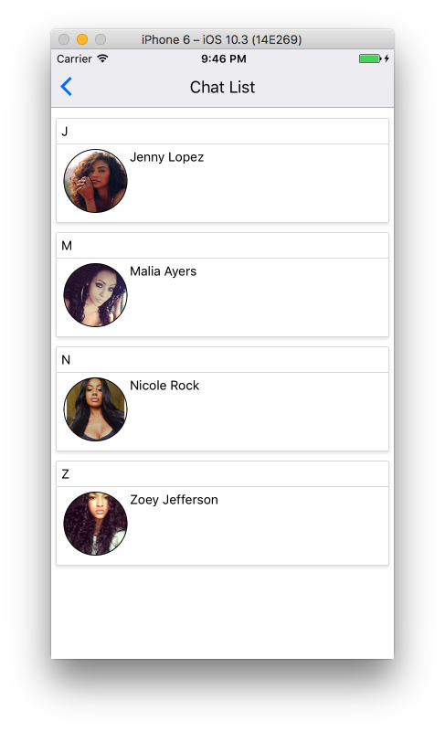
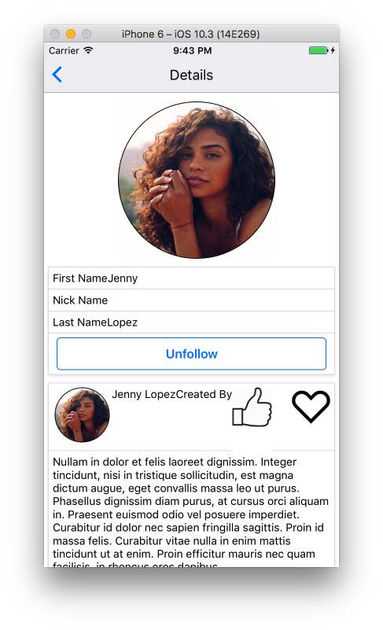
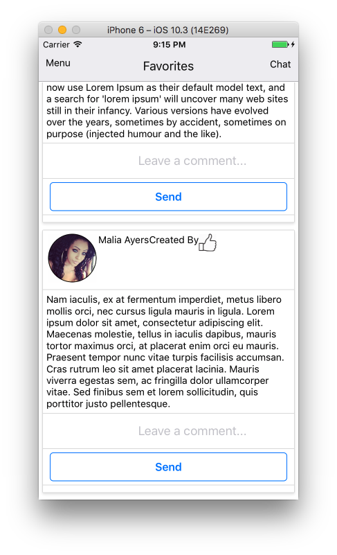
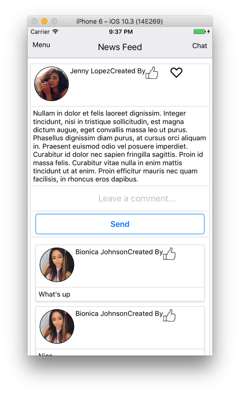
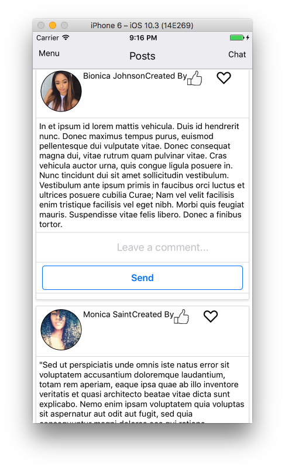
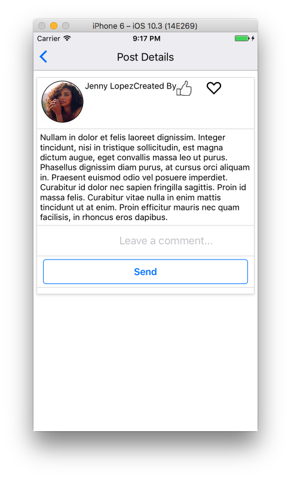

# FirstClassAchievers

This is a Social Web App

## To Install & Run Web

`npm i` 
`npm start`  

## To Install & Run Mobile

`cd native` 
`npm i` 

For iOS 
`react-native run-ios` 
For Android 
`react-native run-android` 

## Features

### Web & Mobile
### Chat
#### Direct Messaging with web sockets
#### Alphabet Contact List

### Notifications
#### Notified when invite to chat, messaged, and followed
#### Notifications linked to recent activity

### Authenication
### Unauthenticated View & Authenicated View

### Favorites

### Followers

### NewsFeed

### Posts (Testimonials)

### Profile

### Detail Pages

### Comments
### Likes
### Cloud Stored Images

### Cloud Stored Database
### Responsive Layout

## Tech Stack

### React.js
### Redux.js
### Node.js
### Express.js
### Socket IO
### PostgreSQL
### Heroku
### ElephantSQL
### Cloudinary